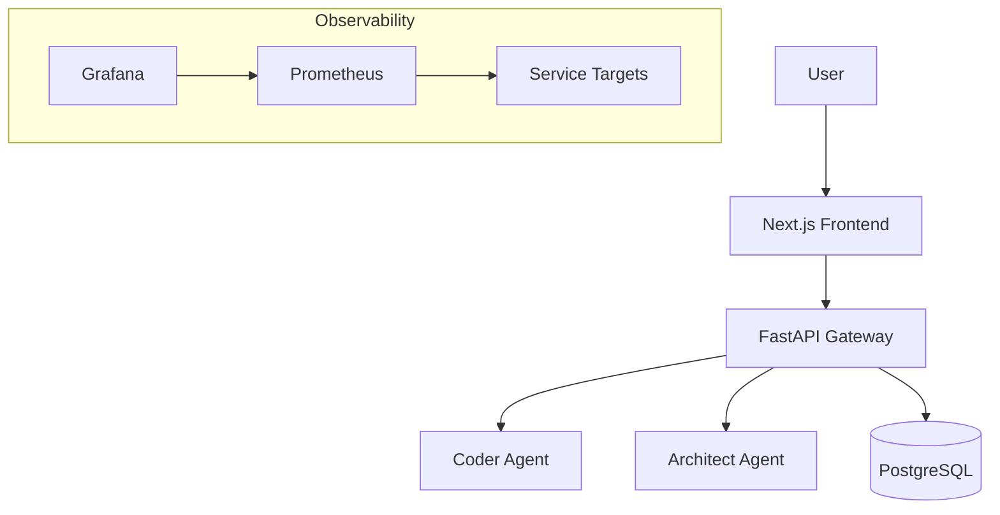

# 🚀 HyperCode V2.0

> **The Neurodivergent-First AI-Native Development Ecosystem**


**HyperCode V2.0** is not just an IDE—it's a **cognitive prosthesis** for developers. Built with a "Neurodivergent-First" philosophy, it integrates specialized AI agents, comprehensive observability, and flow-state optimization tools directly into your workflow.

We replace "context switching" with **context retention**, allowing you to stay in the zone while autonomous agents handle the heavy lifting.

---

## 💎 Core Features

### 🧠 Neurodivergent-First Design
- **Hyperfocus Mode**: Distraction-free interfaces that adapt to your cognitive load.
- **Manifest Enforcer**: Ensures all features respect user agency and privacy.
- **Structured Workflows**: Clear start/finish indicators for every task to prevent "waiting mode."

### 🤖 The Agent Swarm
- **BROski Orchestrator**: Manages multi-agent workflows and complex dependencies.
- **Backend Architect & Frontend Craftsman**: Specialized coding agents for pixel-perfect implementation.
- **Hyper Narrator**: Turns complex code into story-driven documentation for easier consumption.

### 📊 Full Stack Observability
- **Pre-configured Prometheus**: Automatic metric scraping for all services.
- **Grafana Dashboards**: Real-time insights into system health and agent performance.
- **Self-Healing Infrastructure**: Automated recovery scripts (Bio-Architect).

---

## ⚡ Quick Start

Get the entire ecosystem running in **under 2 minutes**.

### Prerequisites
- Docker & Docker Compose
- Node.js 18+ (for local frontend dev)

### Installation

1. **Clone the repository**
   ```bash
   git clone https://github.com/welshDog/HyperCode-V2.0.git
   cd HyperCode-V2.0
   ```

2. **Launch the Stack**
   ```bash
   docker-compose up -d
   ```

3. **Access the Interfaces**
   - 🖥️ **Web Interface**: `http://localhost:3000`
   - 📊 **Grafana**: `http://localhost:3001` (User: `admin` / Pass: `admin`)
   - 📈 **Prometheus**: `http://localhost:9090`

---

## 🏗️ Architecture



## 🤝 Contributing

We welcome contributions from everyone, especially neurodivergent developers! Please read our [Contributing Guide](.github/CONTRIBUTING.md) to get started.

---

## 📜 License

This project is licensed under the MIT License.
