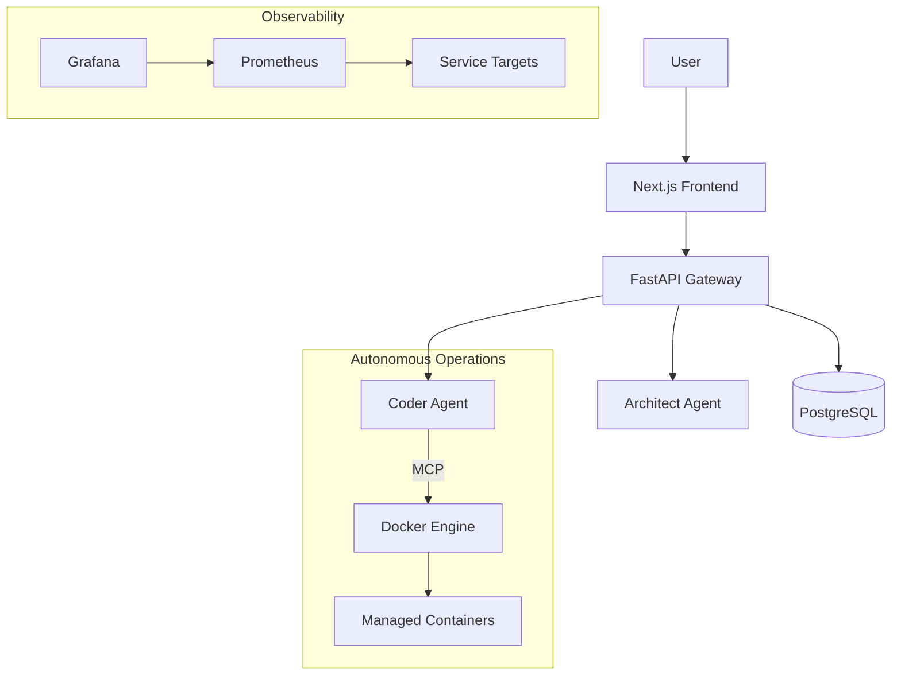

# 🚀 HyperCode V2.0

> **The Neurodivergent-First AI-Native Development Ecosystem**


**HyperCode V2.0** is not just an IDE—it's a **cognitive prosthesis** for developers. Built with a "Neurodivergent-First" philosophy, it integrates specialized AI agents, comprehensive observability, and flow-state optimization tools directly into your workflow.

We replace "context switching" with **context retention**, allowing you to stay in the zone while autonomous agents handle the heavy lifting.

---

## 💎 Core Features

### 🧠 Neurodivergent-First Design
- **Hyperfocus Mode**: Distraction-free interfaces that adapt to your cognitive load.
- **Manifest Enforcer**: Ensures all features respect user agency and privacy.
- **Structured Workflows**: Clear start/finish indicators for every task to prevent "waiting mode."

### 🤖 The Agent Swarm
- **BROski Orchestrator**: Manages multi-agent workflows and complex dependencies.
- **Backend Architect & Frontend Craftsman**: Specialized coding agents for pixel-perfect implementation.
- **Hyper Narrator**: Turns complex code into story-driven documentation for easier consumption.

### 📊 Full Stack Observability
- **Pre-configured Prometheus**: Automatic metric scraping for all services.
- **Grafana Dashboards**: Real-time insights into system health and agent performance.
- **Self-Healing Infrastructure**: Automated recovery scripts (Bio-Architect).

---

## ⚡ Quick Start

Get the entire ecosystem running in **under 2 minutes**.

### Prerequisites
- Docker & Docker Compose
- Node.js 18+ (for local frontend dev)

### Installation

1. **Clone the repository**
   ```bash
   git clone https://github.com/welshDog/HyperCode-V2.0.git
   cd HyperCode-V2.0
   ```

2. **Launch the Stack**
   ```bash
   docker-compose up -d
   ```

3. **Access the Interfaces**
   - 🖥️ **Web Interface**: `http://localhost:3000`
   - 📊 **Grafana**: `http://localhost:3001` (User: `admin` / Pass: `admin`)
   - 📈 **Prometheus**: `http://localhost:9090`

---

## 🏗️ Architecture



### 🛡️ Network Security Architecture

HyperCode V2.0 employs a strict 3-tier network segmentation strategy to enforce least-privilege access:

- **frontend-net**: Public-facing zone. Contains `nginx` (Prod) or exposed ports for `dashboard` and `grafana`.
- **backend-net**: Internal application zone. Hosts `hypercode-core`, Agent Swarm, and monitoring collectors. No direct external access.
- **data-net**: Restricted data zone. Hosts `postgres` and `redis`. Only accessible by `hypercode-core` and authorized data agents.

All inter-service communication is strictly controlled via Docker internal networks.

## 📚 Documentation Index

We maintain comprehensive documentation to ensure clarity and traceability.

- **Quickstart:** [QUICKSTART](docs/QUICKSTART.md)
- **Mission API:** [MISSION.API](docs/MISSION.API.md)
- **Manifesto:** [HYPERCODE-MANIFESTO](docs/HYPERCODE-MANIFESTO.md)
- **Getting Started:** [Onboarding Guide](docs/getting_started.md)
- **Technical Deep Dive:** [Architecture](docs/architecture.md)
- **Integration:** [API Reference](docs/api_reference.md) | [MCP Integration](docs/MCP_INTEGRATION.md)
- **Operations:** [Runbook](runbook.md) | [Security Threat Model](docs/security_threat_model.md)
- **Quality Assurance:** [Traceability Matrix](docs/traceability_matrix.md) | [Benchmarks](docs/benchmarks.md)
- **Governance:** [ADR-001](docs/ADR-001-MCP-Integration.md) | [Changelog](CHANGELOG.md)

## 🧪 Running Tests

```bash
# Core tests (stable)
pytest -v -m "not experimental"

# All tests (including WIP)
pytest -v
```

## 🩺 Health Check Mission Flow

- Endpoint: POST /orchestrator/mission/{mission_id}/report
- Payload: JSON report including agent_id and structured results
- Artifacts: Saved under reports/health_check_{agent_id}_{timestamp}.json
- Audit: Retrieved via GET /orchestrator/{mission_id}/audit

### Dashboard Auto-Refresh

- Open http://localhost:8088/
- Use Health Check Report section to submit reports
- Toggle Auto-Refresh to poll audit entries with backoff
- Last refresh timestamp and status shown inline

## 🤝 Contributing

We welcome contributions from everyone, especially neurodivergent developers! Please read our [Contributing Guide](.github/CONTRIBUTING.md) to get started.

---

## 📜 License

This project is licensed under the MIT License.

---
> *Built with WelshDog + BROski* 🚀🌙
