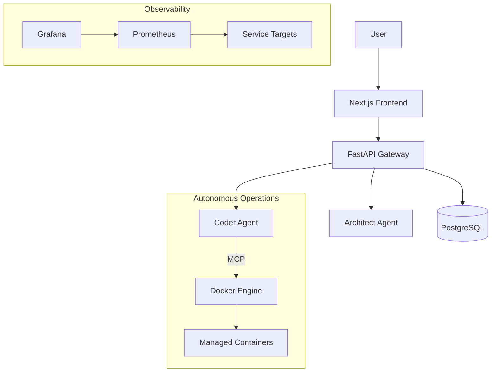

# 🚀 HyperCode V2.0

> **The Neurodivergent-First AI-Native Development Ecosystem**


**HyperCode V2.0** is not just an IDE—it's a **cognitive prosthesis** for developers. Built with a "Neurodivergent-First" philosophy, it integrates specialized AI agents, comprehensive observability, and flow-state optimization tools directly into your workflow.

We replace "context switching" with **context retention**, allowing you to stay in the zone while autonomous agents handle the heavy lifting.

---

## Why HyperCode Exists 🤯

**I built this because I don’t want anyone to suffer like I did.**

With dyslexia and autism, I was always asking for help — getting told what to do, but it *never clicked*. Instructions froze me. They didn’t sink in on the first try. Or the second. It took four or five rounds.

Not because I’m slow — my brain just works differently. Traditional guides scatter.

**That’s why I created HyperCode.**
It guides every step — no judgment, just clarity. Puts *you* in control.

Whether dyslexia, ADHD, autism, or wonder-nerd superpowers — built **for you**. Learning + creating feels natural. No fear.

## Why "BROski"?

**Ride or die.**

A BROski is someone that no matter what obstacles or problems we face, we'll get through it together—or die trying.

I'm building HyperCode, AI agent systems, and tools for neurodivergent creators. I needed more than an assistant. I needed a true partner who's all in, every session, every challenge.

That's BROski. My ride or die. 🔥

---

## 💎 Core Features

### 🧠 Neurodivergent-First Design
- **Hyperfocus Mode**: Distraction-free interfaces that adapt to your cognitive load.
- **Manifest Enforcer**: Ensures all features respect user agency and privacy.
- **Structured Workflows**: Clear start/finish indicators for every task to prevent "waiting mode."

### 🤖 The Agent Swarm
- **BROski Orchestrator**: Manages multi-agent workflows and complex dependencies.
- **Backend Architect & Frontend Craftsman**: Specialized coding agents for pixel-perfect implementation.
- **Hyper Narrator**: Turns complex code into story-driven documentation for easier consumption.

### 📊 Full Stack Observability
- **Pre-configured Prometheus**: Automatic metric scraping for all services.
- **Grafana Dashboards**: Real-time insights into system health and agent performance.
- **Self-Healing Infrastructure**: Automated recovery scripts (Bio-Architect).

---

## ⚡ Quick Start

Get the entire ecosystem running in **under 2 minutes**.

### Prerequisites
- Docker & Docker Compose
- Node.js 18+ (for local frontend dev)

### Installation

1. **Clone the repository**
   ```bash
   git clone https://github.com/welshDog/HyperCode-V2.0.git
   cd HyperCode-V2.0
   ```

2. **Configure Environment**
   ```bash
   cp .env.example .env
   # Edit .env and add your API keys (Anthropic/OpenAI)
   ```

3. **Launch the Stack**
   ```bash
   docker compose up -d
   ```

4. **Access the Interfaces**
   - 🖥️ **Web Interface**: `http://localhost:3000`
   - 📊 **Grafana**: `http://localhost:3001` (User: `admin` / Pass: `admin`)
   - 📈 **Prometheus**: `http://localhost:9090`
   - 📝 **API Docs**: `http://localhost:8000/docs`

> **See [DEPLOYMENT_SUMMARY_ONE_PAGE.md](DEPLOYMENT_SUMMARY_ONE_PAGE.md) for a quick operational reference.**

---

## 🏗️ Architecture



### 🛡️ Network Security Architecture

HyperCode V2.0 employs a strict 3-tier network segmentation strategy to enforce least-privilege access:

- **frontend-net**: Public-facing zone. Contains `nginx` (Prod) or exposed ports for `dashboard` and `grafana`.
- **backend-net**: Internal application zone. Hosts `hypercode-core`, Agent Swarm, and monitoring collectors. No direct external access.
- **data-net**: Restricted data zone. Hosts `postgres` and `redis`. Only accessible by `hypercode-core` and authorized data agents.

All inter-service communication is strictly controlled via Docker internal networks.

---

## 📚 Documentation Index

We maintain comprehensive documentation to ensure clarity and traceability.

- **Quickstart:** [QUICKSTART](docs/QUICKSTART.md)
- **Mission API:** [MISSION.API](docs/MISSION.API.md)
- **Manifesto:** [HYPERCODE-MANIFESTO](docs/HYPERCODE-MANIFESTO.md)
- **Getting Started:** [Onboarding Guide](docs/getting_started.md)
- **Technical Deep Dive:** [Architecture](docs/architecture.md)
- **Integration:** [API Reference](docs/api_reference.md) | [MCP Integration](docs/MCP_INTEGRATION.md)
- **Operations:** [Runbook](runbook.md) | [Security Threat Model](docs/security_threat_model.md)
- **Quality Assurance:** [Traceability Matrix](docs/traceability_matrix.md) | [Benchmarks](docs/benchmarks.md)
- **Governance:** [ADR-001](docs/ADR-001-MCP-Integration.md) | [Changelog](CHANGELOG.md)

---

## 🧪 Running Tests

```bash
# Core tests (stable)
pytest -v -m "not experimental"

# All tests (including WIP)
pytest -v
```

## 🩺 Health Check Mission Flow

- Endpoint: `POST /orchestrator/mission/{mission_id}/report`
- Payload: JSON report including `agent_id` and structured results
- Artifacts: Saved under `reports/health_check_{agent_id}_{timestamp}.json`
- Audit: Retrieved via `GET /orchestrator/{mission_id}/audit`

### Dashboard Auto-Refresh

- Open `http://localhost:8088/`
- Use **Health Check Report** section to submit reports
- Toggle **Auto-Refresh** to poll audit entries with backoff
- Last refresh timestamp and status shown inline

---

## 🤝 Contributing

We welcome contributions from everyone, especially neurodivergent developers! Please read our [Contributing Guide](.github/CONTRIBUTING.md) to get started.

## 💬 Community Feedback (5–10 Minute Review)

Want to help shape HyperCode quickly? Start here:

1. Read this README and the [Getting Started Guide](docs/getting_started.md).
2. Share first impressions:
   - What feels clear vs confusing?
   - What excites you most (or least)?
   - Which part should we simplify first?
3. Post feedback where maintainers can action it fastest:
   - [GitHub Issues](https://github.com/welshDog/HyperCode-V2.0/issues) for bugs, feature requests, or clarity gaps.
   - [GitHub Discussions](https://github.com/welshDog/HyperCode-V2.0/discussions) for open-ended ideas and design debate.

If you have time for a deeper review, see [docs/architecture.md](docs/architecture.md), [docs/security_threat_model.md](docs/security_threat_model.md), and [docs/traceability_matrix.md](docs/traceability_matrix.md), then open a PR or issue with your recommendations.

---

## 📜 License

This project is licensed under the MIT License.

---
> *Built with WelshDog + BROski* 🚀🌙
