# HyperCode System Architecture

```mermaid
graph TD
    %% User Layer
    User((👤 User))
    
    %% Interfaces
    subgraph Interfaces ["🖥️ Interfaces"]
        IDE[Hyperflow Editor]
        Term[BROski Terminal]
    end
    
    %% NEXUS Cognitive Layer
    subgraph Nexus ["🧠 NEXUS Cognitive Layer"]
        Cortex[CORTEX<br/>Intent Engine]
        Pulse[PULSE<br/>Energy Monitor]
        Weaver[WEAVER<br/>Context Graph]
        Bridge[BRIDGE<br/>Translator]
        
        Cortex --> Weaver
        Cortex --> Pulse
        Pulse --> Cortex
    end
    
    %% PANTHEON Execution Layer
    subgraph Pantheon ["🏛️ PANTHEON Execution Layer"]
        Broski[BROski<br/>Orchestrator]
        
        subgraph Specialists ["Specialist Swarm"]
            Core[CORE<br/>Backend]
            Pixel[PIXEL<br/>Frontend]
            Tester[TESTER<br/>QA/Test]
            Shield[SHIELD<br/>Security]
        end
        
        Broski --> Core
        Broski --> Pixel
        Broski --> Tester
        Broski --> Shield
    end
    
    %% Infrastructure
    subgraph Infra ["🏗️ Infrastructure"]
        DB[(PostgreSQL)]
        Vector[(ChromaDB)]
        Redis[(Redis)]
        Docker[Docker Engine]
    end
    
    %% Connections
    User <--> IDE
    User <--> Term
    
    IDE --> Cortex
    Term --> Cortex
    
    Cortex --> Broski
    Broski --> Bridge
    Bridge --> User
    
    Weaver <--> Vector
    Weaver <--> DB
    
    Core --> Docker
    Core --> DB
    Pixel --> IDE
    
    %% Data Flow Styling
    linkStyle default stroke:#666,stroke-width:2px;
```

## System Flow
1. **Input**: User types natural language into Terminal/IDE.
2. **Cognition**: NEXUS (Cortex) analyzes intent, checks energy (Pulse), and retrieves context (Weaver).
3. **Orchestration**: BROski breaks down the task and assigns it to Specialists (Pantheon).
4. **Execution**: Specialists write code, run tests, and validate security.
5. **Translation**: BRIDGE formats the result back to the User.
