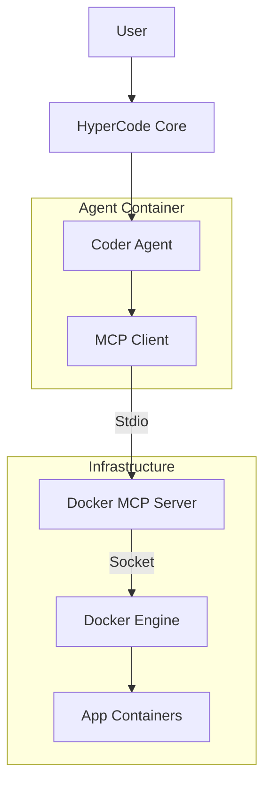

# 🤖 MCP Integration: Autonomous Agent Architecture

## Overview
HyperCode's CoderAgent uses the **Model Context Protocol (MCP)** to interact directly with Docker infrastructure, enabling autonomous deployment and monitoring. This transforms the agent from a passive code generator into an active DevOps engineer capable of managing its own execution environment.

## 🏗️ Architecture



## 🛠️ Capabilities

The agent currently supports the following Docker MCP tools:

- **`create-container`**: Spin up isolated test environments
- **`deploy-compose`**: Launch multi-service stacks
- **`get-logs`**: Debug running containers
- **`list-containers`**: Monitor infrastructure health

## 🚀 Usage

Trigger autonomous deployment via the agent API:

```python
# Trigger agent deployment
response = await agent.analyze_and_deploy({
    "code": "print('Hello world')",
    "type": "analyze_and_deploy"
})
```

## 🔒 Security

- **Socket Access**: The Docker socket (`/var/run/docker.sock`) is mounted read-write to the agent container.
- **User Permissions**: The agent runs as a non-root user (`appuser`) but has access to the Docker group.
- **Isolation**: Agent operations should be sandboxed where possible (future work).

## 🔧 Configuration

### `agents/mcp-config.json`
Configuration for the MCP server connection:

```json
{
  "mcpServers": {
    "docker": {
      "command": "docker",
      "args": ["run", "-i", "--rm", 
               "-v", "/var/run/docker.sock:/var/run/docker.sock",
               "docker/cagent-mcp-server:latest"]
    }
  }
}
```

### Environment Variables
- `DOCKER_HOST`: `unix:///var/run/docker.sock`

---
> *Built with WelshDog + BROski* 🚀🌙
