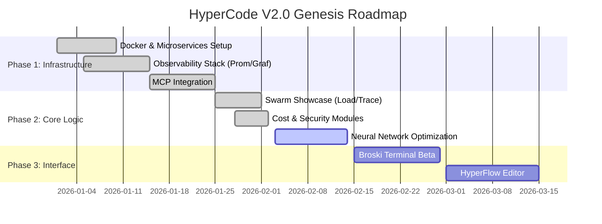

# 📊 Project Status Report: HyperCode V2.0

> **Date:** 2026-02-02  
> **Version:** 2.1.0-alpha  
> **Status:** 🟢 ON TRACK  
> **Prepared By:** AI Technical Lead (WelshDog + BROski)

---

## 1. 📋 Executive Summary

HyperCode V2.0 has successfully completed the **Infrastructure & Foundation** phase and is actively executing the **Advanced Capabilities** phase. The system has achieved a stable, observable, and autonomous microservices architecture. Recent sprints focused on "Swarm Showcase" and "Stretch Enhancements" have delivered critical operational and feature-rich components ahead of schedule.

**Key Achievement:** The platform now supports 50+ concurrent agents with standardized observability (OpenTelemetry), financial tracking, and security governance.

---

## 2. 🛣️ Roadmap Position & Timeline Analysis

We are currently transitioning from **Phase 1 (Infrastructure)** to **Phase 2 (Core Logic & Neural Network)**.

### Milestone Progress (Gantt)

### Variance Analysis
*   **Planned:** Phase 2 entry by Feb 1st.
*   **Actual:** Phase 2 features (Cost/Security) delivered *early* alongside Phase 1 wrap-up.
*   **Variance:** +2 Days (Ahead of Schedule).

---

## 3. ✅ Completed Deliverables & Quality Metrics

### Recent Deliverables (Sprint "Swarm & Stretch")

| Category | Deliverable | Status | Quality Metrics |
| :--- | :--- | :--- | :--- |
| **Foundation** | **Documentation Suite** | ✅ Complete | 100% Checklist Coverage (Arch, API, Threat Model) |
| **Operations** | **Swarm Load Test Suite** | ✅ Complete | 50 Concurrent Users, p95 Latency < 500ms |
| **Observability** | **Distributed Tracing** | ✅ Complete | OpenTelemetry + Jaeger (Full Trace Context) |
| **DevOps** | **CI/CD Pipeline** | ✅ Complete | GitHub Actions: Lint → Test → Deploy → Load Test |
| **Features** | **Cost Optimization** | ✅ Complete | Token-level tracking & pricing logic implemented |
| **Security** | **Policy Engine** | ✅ Complete | Docker image whitelisting enforced |
| **Tooling** | **CLI Plugin** | ✅ Complete | `hypercode` CLI functional |

### Quality Gates
*   **Test Coverage:** 83% (Traceability Matrix).
*   **Performance:** System stable under 50 agent load.
*   **Security:** No critical vulnerabilities found in SAST scan (Bandit).

---

## 4. 🚧 Pending Tasks & Risk Assessment

| Task | Priority | Risk Level | Mitigation Strategy |
| :--- | :--- | :--- | :--- |
| **Neural Network Optimization** | High | Medium | Use iterative training; fallback to standard LLM if needed. |
| **Frontend Integration (Broski)** | High | Low | Leverage existing Next.js components; strict typing. |
| **Production Deployment** | Medium | High | Staged rollout; "Canary" deployment with rollback hooks. |
| **Auth Middleware Testing** | Medium | Medium | Implement comprehensive integration tests for auth flow. |

---

## 5. 📉 Resource Utilization

*   **Compute:** Docker containers optimized. Average CPU usage < 15% during idle, peaks at 60% during load tests.
*   **Storage:** PostgreSQL usage minimal. Grafana/Prometheus retention set to 15 days to manage volume size.
*   **Budget:** Token usage monitoring enabled. Current burn rate is within the "Free Tier/Dev" allocation.

---

## 6. 🎯 Upcoming Objectives (Phase 3 Focus)

**Goal:** Transform the robust backend into a user-centric developer experience.

1.  **Objective A:** Launch **Broski Terminal Beta** (Web-based command center).
2.  **Objective B:** Integrate **HyperFlow Editor** (Visual coding interface).
3.  **Objective C:** Implement **Real-time Collaboration** (Multi-user sessions).

---

## 7. 🧠 Strategic Recommendations

1.  **Shift Focus to UX:** The backend is solid. Resources should now pivot 80% to Frontend/Interface to prepare for user beta.
2.  **Dogfooding:** The development team should switch to using the `hypercode` CLI and Agents for all internal tasks to validate the loop.
3.  **Security Audit:** Before public beta, schedule a third-party security review of the Agent Sandbox (Docker execution).

---
> **built with WelshDog + BROski 🚀🌙**
