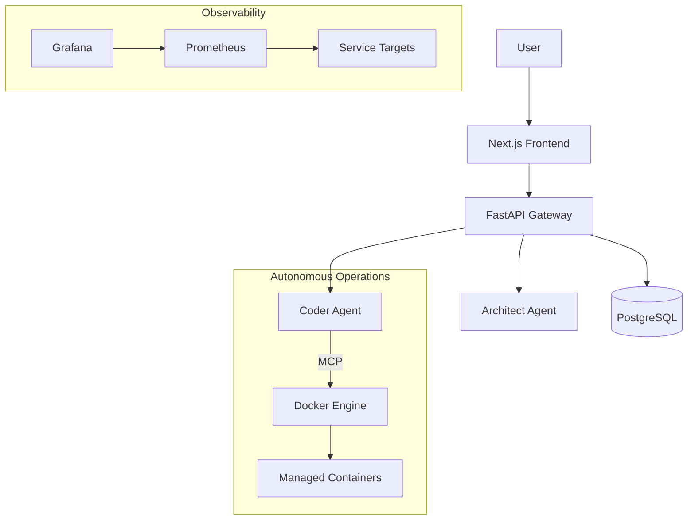

# HyperCode V2.0 Architecture

> **built with WelshDog + BROski 🚀🌙**

## Overview

HyperCode V2.0 is an autonomous AI coding platform designed to facilitate collaboration between human developers and AI agents. It leverages a microservices architecture, utilizing the Model Context Protocol (MCP) for agent communication and Docker for isolated execution environments.

## High-Level Architecture

## Core Components

### 1. Frontend (Next.js)
- **Role:** User interface for interacting with the system.
- **Tech Stack:** Next.js, React, TypeScript.
- **Responsibility:**
  - Authenticating users.
  - Displaying project status and agent activities.
  - Sending commands to the backend API.

### 2. API Gateway (FastAPI)
- **Role:** Central entry point for all requests.
- **Tech Stack:** Python, FastAPI.
- **Responsibility:**
  - Routing requests to appropriate agents.
  - Managing user sessions and authentication.
  - Interacting with the PostgreSQL database.

### 3. Coder Agent
- **Role:** Autonomous coding agent capable of executing tasks.
- **Tech Stack:** Python, LangChain (or similar), MCP Client.
- **Responsibility:**
  - Analyzing codebases.
  - Generating code patches.
  - Deploying containers via MCP.
  - Running tests.

### 4. Model Context Protocol (MCP) Server
- **Role:** Standardized interface for agents to interact with the environment.
- **Responsibility:**
  - Exposing tools (filesystem, Docker, shell) to agents safely.
  - Maintaining context across agent sessions.

### 5. Data Layer
- **PostgreSQL:** Stores user data, project metadata, and execution logs.
- **Redis:** Used for caching and pub/sub for real-time updates.

## Data Flow

1. **Task Submission:** User submits a task via Frontend.
2. **Orchestration:** API Gateway receives the task and delegates it to the Architect Agent (if high-level) or Coder Agent (if implementation-focused).
3. **Execution:** Coder Agent analyzes the request, retrieves necessary context via MCP, and executes changes.
4. **Validation:** Agent runs tests inside a Docker container.
5. **Feedback:** Results are streamed back to the user via WebSocket/SSE.

## Security Architecture

- **Isolation:** Agents run in isolated containers.
- **Access Control:** MCP enforces strict permissions on what tools agents can access.
- **Network Policy:** Internal services communicate over a private Docker network.

## Deployment View

The system is deployed using `docker-compose` for local development and can be scaled to Kubernetes for production.

---
> **built with WelshDog + BROski 🚀🌙**
