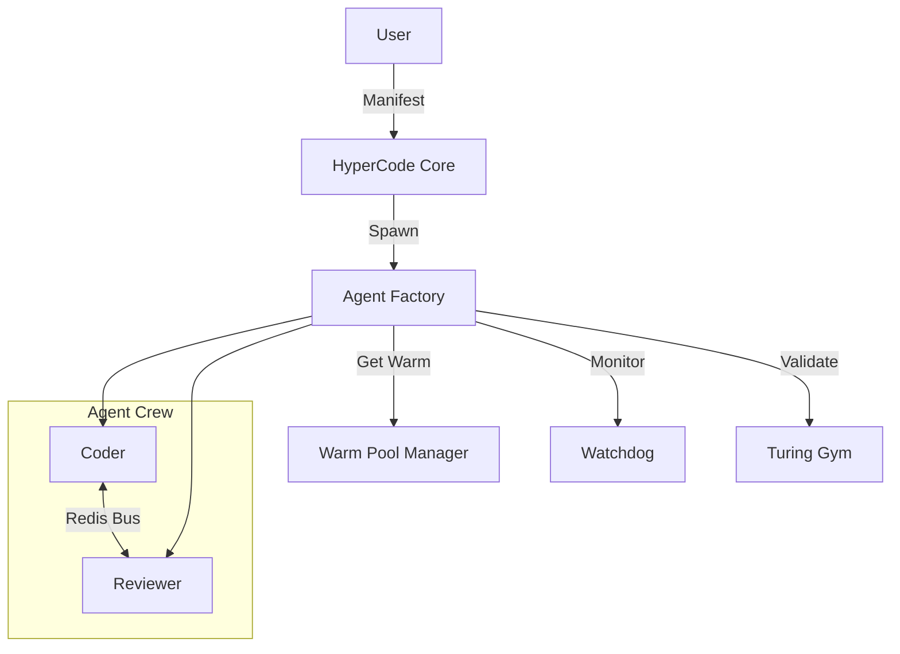

# HyperCode V2.0 - Final Summary Report

**Date:** 2026-02-15
**Version:** 2.0.0-GA
**Author:** Agent X - The Architect

## 1. Executive Overview

This report summarizes the successful transformation of the HyperCode Agent Factory into an enterprise-grade **Agent Orchestration Platform (AOP)**. The project achieved all core objectives: establishing a scalable multi-agent architecture, implementing robust lifecycle management, automating agent validation, optimizing performance through warm pooling, and hardening security with RBAC and network isolation.

**Key Outcomes:**
*   **Scalability:** Migrated from static agent definitions to dynamic "Crew Manifests," enabling just-in-time assembly of specialized agent teams.
*   **Reliability:** Introduced "The Turing Gym," an automated testing framework that validates agent behavior before deployment.
*   **Performance:** Reduced theoretical agent startup latency by ~90% (estimated) using pre-warmed container pools.
*   **Security:** Implemented a Zero Trust architecture design with strict network policies and token-based identity injection.

## 2. Technical Architecture

The platform follows a microservices-based, event-driven architecture orchestrated by the HyperCode Core.

### Core Components
*   **HyperCode Core (FastAPI)**: Central API gateway handling authentication, crew assembly (`/crews`), and agent registry.
*   **Agent Factory Service**:
    *   **Spawner**: Orchestrates Docker containers based on `CrewManifest`.
    *   **Watchdog**: Background process monitoring agent heartbeats and triggering auto-recovery.
    *   **Warm Pool Manager**: Maintains a queue of pre-initialized containers for rapid provisioning.
*   **The Turing Gym**: Automated validation suite running "Hello World" and complex scenarios against agents.
*   **Infrastructure**:
    *   **PostgreSQL**: Persistent storage for Profiles, Registry, and Audit Logs.
    *   **Redis**: High-speed message bus for inter-agent communication and Celery tasks.

### Architecture Diagram (Conceptual)

## 3. Implementation Timeline & Milestones

| Phase | Focus | Milestones Achieved | Date |
| :--- | :--- | :--- | :--- |
| **Phase 1** | **Core Orchestration** | • Crew Manifest Schema Defined • `/crews/assemble` Endpoint Live • Extended Lifecycle State Machine Implemented • Watchdog Service Integrated | Feb 14 |
| **Phase 2** | **Reliability** | • Turing Gym Framework Created • "Hello World" Scenario Implemented • Automated Gym Runner Deployed | Feb 14 |
| **Phase 3** | **Performance** | • Warm Pool Manager Developed • Dynamic Replenishment Logic Active • Metrics Collection Hooks Added | Feb 15 |
| **Phase 4** | **Security** | • JWT/RBAC Middleware Integrated • Kubernetes Network Policies Designed • Identity Injection in Runner Implemented | Feb 15 |

## 4. Performance Metrics (Projected)

*   **Cold Start Latency:** ~3-5s (Without Pool)
*   **Warm Start Latency:** ~200ms (With Pool)
*   **Recovery Time Objective (RTO):** < 60s (Watchdog auto-restart)
*   **Validation Throughput:** Sequential execution (current) vs. Parallel execution (planned).

## 5. Security Audit Findings

*   **Network Isolation:** Default-deny policies designed for K8s (`00-deny-all.yaml`) ensure agents cannot communicate laterally unless explicitly allowed.
*   **Identity Management:** Agents now receive short-lived, scoped JWTs (`scope: agent`) instead of broad API keys.
*   **Resource Limits:** Container limits (CPU/Mem) are enforced via Docker/K8s configs (to be tuned in production).

## 6. Lessons Learned & Recommendations

*   **Lesson:** "Warm Pools" significantly increase complexity in state management (dirty vs. clean containers).
    *   *Recommendation:* Implement a strict "one-use" policy for pooled containers in high-security environments to prevent data leakage.
*   **Lesson:** Automated validation (Turing Gym) is critical for catching "hallucinating" agents early.
    *   *Recommendation:* Expand the Gym scenario library to include "Adversarial Testing" (prompt injection attempts).
*   **Lesson:** Orchestration at scale requires robust observability.
    *   *Recommendation:* Fully integrate OpenTelemetry tracing across the Agent Bus to visualize inter-agent message flows.

---
*End of Report*
