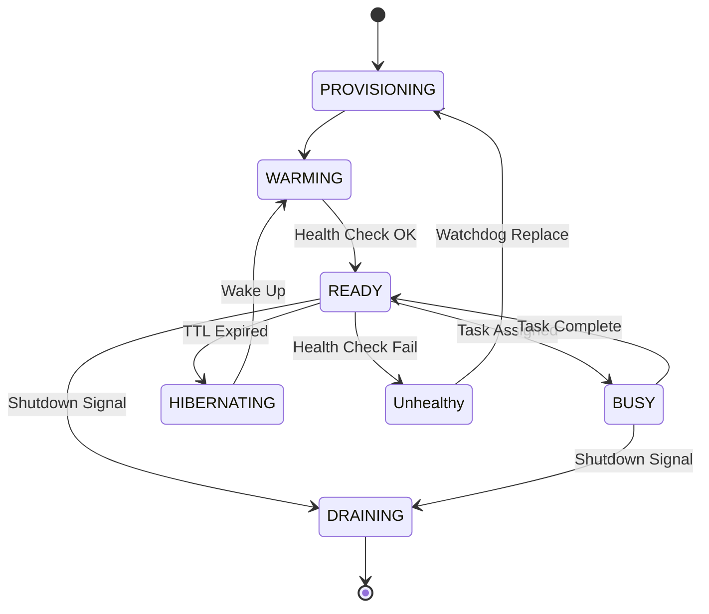

# 🏭 Hyper Agent Factory: Enhancement Proposal

## Executive Summary
This proposal expands upon the initial **Hyper Agent Factory** specification to support enterprise-grade **multi-agent orchestration**, **dynamic lifecycle management**, and **secure agent isolation**. By evolving the Factory from a simple spawner into a comprehensive **Agent Orchestration Platform (AOP)**, we enable HyperCode to support complex, long-running missions involving dynamic crews of specialized agents.

## 1. Technical Specification: Scaling for Multi-Agent Orchestration

To support multi-agent orchestration, the Factory must evolve beyond simple instantiation to provide a **control plane** for agent fleets.

### 1.1 Dynamic Crew Composition
Instead of static agent definitions, the Factory will expose a `Crew` abstraction.
*   **Crew Manifest**: A JSON definition describing a team of agents required for a mission.
*   **Just-in-Time (JIT) Spawning**: Agents are spawned only when the mission starts and decommissioned when complete (or pooled).
*   **Shared Context Bus**: A dedicated Redis channel or ephemeral vector store namespace created for the crew to share state.

### 1.2 Orchestration Interface
The Factory will integrate with the **Crew Orchestrator** via a standardized protocol:
*   `POST /crews/assemble`: Accepts a manifest, spawns agents, and returns a `crew_id` and connection endpoints.
*   `POST /crews/{id}/broadcast`: Sends a signal to all agents in the crew (e.g., "MISSION_START", "PAUSE").

### 1.3 Architecture Update
```mermaid
graph TB
    Orchestrator[Crew Orchestrator] -->|1. Assemble Crew| FactoryAPI
    FactoryAPI -->|2. Resolve Profiles| DB[(Profile DB)]
    FactoryAPI -->|3. Spawn Containers| Spawner
    Spawner -->|4. Create Network| Network[Overlay Network]
    Spawner -->|5. Launch Agents| Fleet[Agent Fleet]
    
    subgraph "Agent Fleet (Crew 123)"
        A1[Coder Agent]
        A2[Reviewer Agent]
        A3[Planner Agent]
    end
    
    A1 <-->|Shared Bus (Redis)| A2
    A2 <-->|Shared Bus (Redis)| A3
```

## 2. Dynamic Agent Lifecycle Management

We will implement a robust state machine with **self-healing** and **resource conservation** capabilities.

### 2.1 Extended State Machine
*   **`PROVISIONING`**: allocating resources, pulling images.
*   **`WARMING`**: container started, loading models/tools.
*   **`READY`**: passing health checks, registered in discovery.
*   **`BUSY`**: currently executing a task (lock acquired).
*   **`HIBERNATING`**: scaled to zero (state saved to DB) after TTL.
*   **`DRAINING`**: finishing current tasks before shutdown.



### 2.2 Health & Healing
*   **Liveness Probe**: Docker health check (restart on fail).
*   **Readiness Probe**: App-level `/health` check (remove from load balancer).
*   **Watchdog**: A sidecar or factory background process that monitors agent heartbeat. If heartbeat misses > 3 intervals:
    1.  Mark agent `UNHEALTHY`.
    2.  Trigger **Auto-Replacement**: Spawn a new instance with the same ID/Context.

## 3. Integration Strategy: Pluggable Capabilities (MCP)

To standardize agent capabilities, we will adopt the **Model Context Protocol (MCP)** as the universal interface.

### 3.1 Capability Registry
*   **Tool Manifest**: Agents declare capabilities as MCP Tools.
*   **Discovery**: The Factory aggregates tools from all active agents into a central **Tool Registry**.
*   **Dynamic Loading**: Agents can mount "Skill Packs" (volumes containing Python scripts or binaries) at runtime based on the profile.

### 3.2 Standard Interfaces
*   **`AgentInterface`**: Base HTTP/RPC contract (Chat, Tools, Memory).
*   **`CapabilityInterface`**: Standardized JSON-RPC 2.0 over HTTP for tool execution.

## 4. Performance Optimization Plan

### 4.1 Resource Pooling (Warm Agents)
To reduce start-up latency (cold start):
*   **Generic Pool**: Maintain a pool of `n` generic "base" containers (Python + Common Libs).
*   **Specialization**: When a request comes in, mount the specific code/profile into a warm container and promote it to `READY`.

### 4.2 Load Balancing
*   **Internal Gateway**: Use a lightweight internal proxy (e.g., Traefik or Nginx) to route traffic to agents via stable DNS names (e.g., `agent-frontend.crew-123.svc`).
*   **Round-Robin**: For stateless agents (e.g., generic LLM processors), load balance requests across multiple instances.

## 5. Security Framework

### 5.1 Isolation & Sandboxing
*   **Network Policies**: Agents in a crew can only talk to each other and the Orchestrator. No internet access unless explicitly granted (`allow_egress: true`).
*   **User Namespaces**: Remap container `root` to an unprivileged host user to prevent breakouts.
*   **Ephemeral Storage**: Agent file systems are read-only root, with a temporary writable `/workspace` volume that is wiped on termination.

### 5.2 Permission Management (RBAC)
*   **Agent Identity**: Each agent gets a short-lived JWT signed by the Factory.
*   **API Scopes**:
    *   `coder`: Can read/write files in `/workspace`.
    *   `reviewer`: Can only read files.
    *   `admin`: Can spawn other agents (Orchestrator only).

## 6. Testing Strategy

### 6.1 Automated Agent Validation (The "Turing Gym")
Before an agent profile is promoted to production, it must pass the **Turing Gym**:
*   **Behavioral Unit Tests**: Mock LLM responses to verify tool execution logic.
*   **Integration Simulation**: Spin up the agent, send a standardized task (e.g., "Write a Hello World python script"), and assert the output file exists and is correct.
*   **Stress Testing**: Flood the agent with requests to verify resource limits and rate limiting.

### 6.2 Chaos Engineering
*   **Random Termination**: Randomly kill agent containers to verify the Factory's self-healing logic.
*   **Latency Injection**: Introduce network lag to test timeout handling.

## 7. Deliverables Timeline

### Phase 1: Foundation (Weeks 1-2)
*   [ ] **Milestone**: Factory API v1 (Create/Stop/Status).
*   [ ] **Milestone**: PostgreSQL Schema for Profiles & Registry.
*   [ ] **Metric**: Spawn generic agent in < 5s.

### Phase 2: Orchestration & Pooling (Weeks 3-4)
*   [ ] **Milestone**: Crew Manifest support.
*   [ ] **Milestone**: Warm Agent Pool implementation.
*   [ ] **Metric**: Crew assembly (3 agents) in < 10s.

### Phase 3: Security & MCP (Weeks 5-6)
*   [ ] **Milestone**: Network Policy enforcement.
*   [ ] **Milestone**: MCP Tool Registry integration.
*   [ ] **Metric**: Zero unauthorized cross-crew network calls.

### Phase 4: Production Readiness (Weeks 7-8)
*   [ ] **Milestone**: Turing Gym automated test suite.
*   [ ] **Milestone**: Chaos testing & Self-healing verification.
*   [ ] **Metric**: 99.9% availability of Agent Registry.
